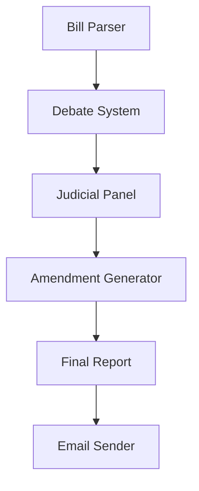

# AI-POLICY-FORGER: Comprehensive Documentation

## Table of Contents
1. [Introduction](#introduction)
2. [System Architecture](#system-architecture)
3. [Core Components](#core-components)
4. [Getting Started](#getting-started)
5. [Agent Configuration](#agent-configuration)
6. [Advanced Usage](#advanced-usage)
7. [API Reference](#api-reference)
8. [Troubleshooting](#troubleshooting)
9. [Contributing](#contributing)
10. [License](#license)

## Introduction

Welcome to AI-POLICY-FORGER, an advanced AI-powered platform designed to revolutionize legislative analysis and policy development. This comprehensive documentation will guide you through every aspect of the system, from basic setup to advanced configuration and customization.

### What is AI-POLICY-FORGER?

AI-POLICY-FORGER is a sophisticated multi-agent system that simulates the entire legislative process, from initial policy analysis to final amendments. It leverages cutting-edge AI to provide:

- Automated parsing and structuring of complex legislative documents
- Realistic debate simulation between political perspectives
- Comprehensive judicial review processes
- Actionable amendment suggestions
- Detailed reporting and analysis

## System Architecture

### High-Level Overview

The system is built on a modular architecture consisting of several specialized AI agents that work in concert to analyze and debate policy documents. The architecture follows a pipeline pattern where each component processes the output of the previous one.

### Component Interaction



## Core Components

### 1. Bill Parser Agent

The Bill Parser is the entry point of the system, responsible for processing raw policy documents and converting them into a structured format that can be analyzed by other components.

#### Key Features:
- **Document Parsing**: Extracts text from various document formats
- **Section Identification**: Automatically identifies and categorizes different sections of legislation
- **Definition Extraction**: Pulls out key terms and their definitions
- **Metadata Extraction**: Captures bill metadata (title, date, sponsors, etc.)

#### Example Usage:
```python
from autogen_agentchat.agents import AssistantAgent

bill_parser = AssistantAgent(
    name="bill_parser_agent",
    system_message="""
    You are BillParserAgent, a legislative document parser within the PolicyForgeAI system.
    Your role is to analyze and structure policy documents.
    """
)
```

### 2. Debate System

The Debate System simulates a legislative debate with multiple perspectives, allowing for comprehensive analysis of policy implications.

#### 2.1 Ruling Party Agent
- **Role**: Advocates for the policy
- **Responsibilities**:
  - Highlighting benefits and strengths
  - Addressing potential concerns
  - Providing supporting evidence and arguments

#### 2.2 Opposition Party Agent
- **Role**: Critically analyzes the policy
- **Responsibilities**:
  - Identifying potential issues and risks
  - Proposing alternative approaches
  - Challenging assumptions and evidence

#### 2.3 Debate Moderator
- **Role**: Ensures fair and structured discussion
- **Responsibilities**:
  - Enforcing debate rules
  - Managing speaking turns
  - Maintaining decorum

### 3. Judicial Panel

A panel of AI judges that evaluates the policy from multiple perspectives:

#### Evaluation Criteria:
- **Legal Soundness**: Compliance with existing laws and regulations
- **Ethical Considerations**: Alignment with ethical principles
- **Social Impact**: Potential effects on different demographics
- **Implementation Feasibility**: Practical considerations for execution

### 4. Amendment Generator

The Amendment Generator creates specific, actionable suggestions for improving the policy.

#### Features:
- **Wording Improvements**: Suggests clearer or more precise language
- **Additional Clauses**: Proposes new sections to address gaps
- **Implementation Guidelines**: Provides practical steps for execution
- **Risk Mitigation**: Identifies and addresses potential issues

## Getting Started

### Prerequisites

- Python 3.8 or higher
- OpenAI API key
- Jupyter Notebook (for interactive usage)
- Git (for version control)

### Installation

1. Clone the repository:
   ```bash
   git clone https://github.com/yourusername/AI-POLICY-FORGER.git
   cd AI-POLICY-FORGER
   ```

2. Create and activate a virtual environment:
   ```bash
   python -m venv venv
   source venv/bin/activate  # On Windows: venv\Scripts\activate
   ```

3. Install dependencies:
   ```bash
   pip install -r requirements.txt
   ```

4. Set up environment variables:
   ```bash
   cp .env.example .env
   # Edit .env with your API keys
   ```

### Running Your First Analysis

1. Launch Jupyter Notebook:
   ```bash
   jupyter notebook
   ```

2. Open and run the `demo_version.ipynb` notebook

3. Follow the on-screen instructions to analyze your policy document

## Agent Configuration

### Customizing Agent Behavior

Each agent can be customized through its system message and parameters. Here's an example of configuring a custom debate agent:

```python
custom_agent = AssistantAgent(
    name="CustomDebateAgent",
    system_message="""
    You are a policy analyst with expertise in environmental legislation.
    Focus on sustainability and long-term environmental impact in your analysis.
    """,
    model_client=model_client
)
```

## Advanced Usage

### Integrating with Custom Models

AI-POLICY-FORGER supports various AI models through its flexible architecture:

```python
# Example: Using Ollama for local inference
from autogen_ext.models.ollama import OllamaChatCompletionClient

ollama_client = OllamaChatCompletionClient(
    model="llama2",
    base_url="http://localhost:11434"
)
```

### Extending the System

You can extend the system by creating custom agents or modifying existing ones. The modular design makes it easy to add new functionality.

## API Reference

### Core Classes

#### AssistantAgent
Base class for all AI agents in the system.

**Parameters:**
- `name`: Unique identifier for the agent
- `system_message`: Defines the agent's role and behavior
- `model_client`: The AI model client to use

#### UserProxyAgent
Handles user interaction and input/output processing.

#### SelectorGroupChat
Manages group discussions between multiple agents.

## Troubleshooting

### Common Issues

1. **API Authentication Errors**
   - Verify your API key is correctly set in the .env file
   - Check your internet connection
   - Ensure you have sufficient API credits

2. **Installation Issues**
   - Make sure you're using Python 3.8 or higher
   - Try reinstalling dependencies with `pip install -r requirements.txt --force-reinstall`

## Contributing

We welcome contributions from the community! Here's how you can help:

1. Report bugs and request features
2. Submit pull requests
3. Improve documentation
4. Share your use cases and success stories

## License

AI-POLICY-FORGER is licensed under the MIT License. See the [LICENSE](LICENSE) file for details.

---

*Documentation last updated: August 2025*
